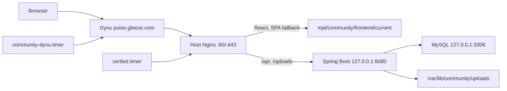
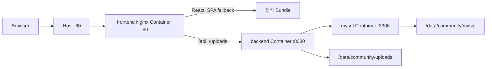

# 한 대의 EC2를 두 번 이해하기: 직접 설치와 Docker Compose로 PULSE 배포하기

- 작성일: 2026-08-05
- 서비스: PULSE 커뮤니티
- 백엔드: Spring Boot 4, Java 21, MySQL
- 프론트엔드: React 19, Webpack, Nginx

> 공개 서비스 주소: <https://pulse.gleeze.com/>
>
> 현재 공개 중인 구성: A 방식(호스트 Nginx + 호스트 Spring Boot + 호스트 MySQL)
>
> B 방식 상태: 이미지·Compose와 격리된 전체 런타임 검증 완료. EC2에서는
> 프론트엔드 컨테이너의 포트 80 정상 상태까지 확인했으며, A 방식과 호스트
> 포트 80이 충돌하므로 현재는 중지했습니다.

## 들어가며

이번 과제에서는 같은 React + Spring 서비스를 서로 다른 두 방식으로
배포합니다.

- **A 방식**: EC2 한 대에 Java, MySQL, Nginx를 직접 설치하고 systemd로
  Spring Boot를 운영합니다.
- **B 방식**: React와 Spring을 각각 멀티스테이지 Docker 이미지로 만들고,
  MySQL까지 Docker Compose로 묶습니다. 프론트엔드 Nginx 컨테이너만 외부에
  공개합니다.

표면적으로는 “Docker를 쓰느냐”의 차이처럼 보였습니다. 하지만 실제로는 배포 단위,
장애를 찾는 방법, 비밀값 전달, 파일 영속성, 롤백의 기준까지 달라지는
작업이었습니다. 그래서 단순히 명령어만 나열하지 않고 다음 순서로
접근했습니다.

1. 현재 구조에서 운영 장애가 날 지점을 먼저 찾습니다.
2. A와 B가 만족해야 하는 공통 보안 기준을 정합니다.
3. 코드로 반복할 수 있는 배포 절차를 만듭니다.
4. 정상 기동뿐 아니라 포트 격리, 권한, 재시작, 영속성까지 검증합니다.
5. 실제로 실패한 지점과 해결 과정을 기록합니다.

이 글의 전개 방식은 Toss Tech의 다음 글들을 참고했습니다. 레거시 상태를 먼저
드러낸 뒤 선택 기준과 최종 구조로 이어지는 방식, 실험 조건과 측정값으로
결론을 증명하는 방식, 운영 설정을 코드로 관리하고 CI 관점에서 검증하는
방식을 참고했습니다. 문장과 구현 내용은 PULSE 프로젝트에 맞게 새로
작성했습니다.

- [레거시 인프라 작살내고 하이브리드 클라우드 만든 썰](https://toss.tech/article/payments-legacy-9)
- [OpenZFS로 성능과 비용, 두 마리 토끼 잡기](https://toss.tech/article/engineering-note-8)
- [유연하고 안전하게 배포 파이프라인 운영하기](https://toss.tech/article/slash23-devops)

---

## 1. 배포를 시작하기 전에 운영 정보를 먼저 고정합니다

### 1.1 배포 주소와 공개 상태

| 항목                  | 값                                                  |
| --------------------- | --------------------------------------------------- |
| 공개 주소             | <https://pulse.gleeze.com/>                         |
| 무료 호스트 이름         | Dynu `pulse.gleeze.com`                             |
| TLS                   | Let's Encrypt, Certbot 자동 갱신                   |
| HTTP 정책             | `http://pulse.gleeze.com/*` → 동일 경로 HTTPS 301   |
| A 방식                | 현재 공개 운영 중                                   |
| B 방식                | 격리 전체 검증 및 EC2 프론트엔드 정상 확인 후 중지 |
| B 방식 격리 검증 주소 | `http://127.0.0.1:18088`                            |

EC2 공개 IPv4는 검증 당시 `3.39.194.216`이었지만 Elastic IP를 사용하지
않으므로 중지/시작 후 바뀔 수 있습니다. 따라서 IP는 제출 주소로 사용하지 않고,
Dynu 타이머가 현재 공개 IPv4를 고정 호스트 이름에 계속 반영하도록 구성했습니다.

### 1.2 테스트 계정

운영 회원가입·로그인 기능은 검증했지만 실제 자격증명은 Git과 공개 기술
블로그에 기록하지 않았습니다. 제출용 계정은 공개 서비스에서 새로 회원가입한 뒤
아래 형식으로 **비공개 제출란 또는 별도 안전 채널**을 통해 전달합니다.

| 항목                 | 제출 시 기입 값                      |
| -------------------- | ------------------------------------ |
| 테스트 계정 이메일   | `[운영 환경에서 생성한 제출용 계정]` |
| 테스트 계정 비밀번호 | `[Git에 기록하지 않고 별도 전달]`    |
| 계정 생성 주소       | <https://pulse.gleeze.com/signup>    |

로컬 마이그레이션에 있었던 `email@email.com`은 운영 테스트 계정이 아닙니다.
최신 마이그레이션에서는 이 레거시 계정의 비밀번호를 제거하고 삭제 상태로
전환합니다. 따라서 제출용 계정으로 안내하면 안 됩니다.

### 1.3 실제 검증된 EC2 환경

| 구분              | 실제 값                                     |
| ----------------- | ------------------------------------------- |
| AWS 리전        | 아시아 태평양(서울), `ap-northeast-2`         |
| AMI/OS            | Ubuntu 서버 24.04 LTS                     |
| 아키텍처      | `x86_64`                                    |
| 인스턴스 유형     | `t3.small`                                  |
| 루트 볼륨       | gp3 20 GiB, 암호화, 종료 시 삭제            |
| 접속              | AWS Systems Manager 세션 관리자        |
| IAM 역할          | `community-ec2-ssm-role`                    |
| IAM 정책        | `AmazonSSMManagedInstanceCore`              |
| 인스턴스 메타데이터 | IMDSv2 필수, 홉 제한 1                  |
| 호스트 실행 환경      | OpenJDK 21.0.11, Nginx 1.24.0, MySQL 8.0.46 |
| 공개 인바운드      | TCP 80, 443                                 |
| 비공개 포트       | 22, 8080, 3306                              |
| 비용 기준         | 월 예산 15 USD, 실제 알림 12 USD       |

SSH 22는 산출물을 SCP로 옮길 때만 현재 공인 IP `/32`에 임시로 열었다가
전송 직후 삭제했습니다. 일상적인 운영 접속은 키 페어가 필요 없는 세션
관리자를 사용합니다.

---

## 2. 왜 한 서비스에 두 가지 배포 방식을 적용했을까요?

A 방식은 운영체제 수준에서 애플리케이션이 어떻게 동작하는지 직접 확인하기
좋습니다. 반면 B 방식은 실행 환경을 이미지에 포함하므로 재현성과 격리가
좋습니다.

| 질문          | A 방식                         | B 방식                                  |
| ------------- | ------------------------------ | --------------------------------------- |
| 배포 단위     | JAR, 정적 압축 파일              | 커밋 태그가 붙은 Docker 이미지           |
| 프로세스 관리  | systemd                        | Docker Compose                          |
| 역방향 프록시 | 호스트 Nginx                     | 프론트엔드 Nginx 컨테이너                |
| 백엔드 접근  | `127.0.0.1:8080`               | `backend:8080` Compose DNS              |
| DB 접근       | `127.0.0.1:3306`               | `mysql:3306` Compose DNS                |
| 외부 공개     | 호스트 80/443                    | 프론트엔드 컨테이너 80만 공개            |
| 비밀값        | 루트 소유 환경 파일            | 루트 소유 파일 + Compose 비밀값        |
| 데이터        | 호스트 MySQL + 업로드 경로       | 호스트 바인드 마운트에 MySQL·업로드 저장 |
| 롤백          | 릴리스 심볼릭 링크 전환           | 이전 이미지와 릴리스 환경 파일 전환      |
| 장점          | 구조가 단순하고 OS 학습에 유리 | 환경 재현, 격리, 배포 일관성            |
| 주의점        | 호스트 의존성과 설정 누적        | 이미지·볼륨·네트워크까지 함께 이해 필요  |

두 방식을 같은 EC2에서 **동시에** 공개할 수는 없습니다. 둘 다 호스트의 80번
포트를 사용하기 때문입니다. 실제로 B 방식 프론트엔드 컨테이너가 80번을
점유한 상태에서 호스트 Nginx를 시작하자 다음 오류가 발생했습니다.

```text
nginx: [emerg] bind() to 0.0.0.0:80 failed (98: Address already in use)
```

`docker ps --filter publish=80`으로 점유자를 확인하고 B 방식 컨테이너를
중지한 뒤 A 방식 Nginx를 기동했습니다. 따라서 현재 공개 주소에서는 A
방식이 동작합니다. 두 방식을 동시에 외부에 공개하려면 추가 EC2를 사용하거나,
B 방식에 다른 호스트 포트와 별도 도메인을 배정해야 합니다.

---

## 3. 브라우저가 백엔드 포트를 몰라도 되게 만듭니다

초기 프론트엔드는 현재 호스트의 `:8080`으로 API를 호출했습니다. 이 상태에서는
브라우저가 Spring Boot에 직접 접근해야 하므로 보안 그룹에서 8080을
열어야 합니다. A/B 모두 외부에는 Nginx만 노출하려 했기 때문에 API 주소를
동일 출처 방식으로 바꿨습니다.

프론트엔드의 [`src/shared/config/env.js`](https://github.com/100-hours-a-week/KTB4-ian-community-FE/blob/main/src/shared/config/env.js)는 로컬 개발일 때만
8080을 사용합니다.

```js
export function defaultApiBaseUrl(location = globalThis.location) {
  const resolvedLocation =
    typeof location === "string" ? { hostname: location } : location;
  const hostname = resolvedLocation?.hostname || "localhost";
  const isLocal = hostname === "localhost" || hostname === "127.0.0.1";

  if (isLocal) return `http://${hostname}:8080`;
  if (resolvedLocation?.origin && resolvedLocation.origin !== "null")
    return resolvedLocation.origin;

  return "";
}
```

운영 브라우저는 `/api`, `/uploads`만 호출합니다. A 방식 Nginx는 이를
`127.0.0.1:8080`으로, B 방식 Nginx는 Compose 서비스 이름
`backend:8080`으로 전달합니다. 이 구조 덕분에 CORS 범위가 단순해지고,
8080을 외부에 공개하지 않아도 됩니다.

---

## 4. A 방식: EC2에 직접 설치해 봅니다

### 4.1 최종 구조



호스트에는 다음 세 서비스를 설치했습니다.

- `mysql.service`: 운영 데이터 저장
- `community-backend.service`: Spring Boot JAR 실행
- `nginx.service`: TLS 종료, React 정적 파일, 역방향 프록시

### 4.2 환경 변수와 비밀값

실제 값은 `/etc/community/backend.env`에 `root:community 640`으로 저장합니다.
검증 스크립트는 값 대신 `SET`/`MISSING`만 출력합니다.

```dotenv
SPRING_PROFILES_ACTIVE=aws
DB_URL=jdbc:mysql://127.0.0.1:3306/community?useUnicode=true&characterEncoding=utf8&serverTimezone=Asia/Seoul
DB_USERNAME=community_app
DB_PASSWORD=<secret>
JWT_SECRET=<base64-secret-decoding-to-at-least-32-bytes>
FRONTEND_ORIGIN=https://pulse.gleeze.com
COOKIE_SECURE=true
DB_POOL_MAX_SIZE=10
DB_POOL_MIN_IDLE=2
```

`DB_PASSWORD`, `JWT_SECRET`, Dynu IP 업데이트 비밀번호는 코드·문서·로그에
포함하지 않습니다. JWT 값은 단순 문자열이 아니라 Base64 디코딩 결과가 최소
32바이트여야 합니다.

### 4.3 MySQL을 루프백에 묶기

[`mysql/community.cnf.example`](./method-a/mysql/community.cnf.example)에서
MySQL과 MySQL X 프로토콜을 모두 루프백에 묶었습니다.

```ini
[mysqld]
bind-address = 127.0.0.1
mysqlx-bind-address = 127.0.0.1
character-set-server = utf8mb4
collation-server = utf8mb4_0900_ai_ci
max_connections = 80
innodb_buffer_pool_size = 256M
slow_query_log = ON
long_query_time = 1
```

애플리케이션 계정은 평상시에 CRUD 권한만 가집니다. Flyway가 스키마를
변경해야 하는 배포 구간에만 DDL 권한을 부여하고, 성공·실패와 관계없이
트랩에서 회수합니다.

```bash
"${SCRIPT_DIR}/mysql-migration-access.sh" grant
migration_access_granted=true
systemctl restart community-backend.service

# Backend가 준비되면 다시 회수
"${SCRIPT_DIR}/mysql-migration-access.sh" revoke
migration_access_granted=false
```

### 4.4 운영 프로파일은 생성보다 검증을 선택했습니다

[`application-aws.yaml`](../src/main/resources/application-aws.yaml)은 Flyway가
스키마를 만들고 Hibernate는 일치 여부만 확인하도록 구성했습니다.

```yaml
server:
  address: ${SERVER_ADDRESS:127.0.0.1}
  port: 8080
  shutdown: graceful

spring:
  datasource:
    url: ${DB_URL}
    username: ${DB_USERNAME}
    password: ${DB_PASSWORD}
  jpa:
    hibernate:
      ddl-auto: validate
    open-in-view: false
  flyway:
    enabled: true
    locations: classpath:db/migration/mysql
    clean-disabled: true
  h2:
    console:
      enabled: false
```

운영에서 `ddl-auto=create`나 `update`를 사용하면 애플리케이션 시작이 곧
암묵적인 스키마 변경으로 이어집니다. 그래서 마이그레이션 파일을 배포 이력으로
남기고, Hibernate에는 검증만 맡겼습니다. H2 콘솔도 AWS 프로파일에서는
비활성화했습니다.

### 4.5 JAR을 루트가 아닌 전용 사용자로 실행하기

[`community-backend.service`](./method-a/systemd/community-backend.service)는
로그인 셸이 없는 `community` 사용자로 Spring Boot를 실행합니다.

```ini
[Service]
User=community
Group=community
EnvironmentFile=/etc/community/backend.env
ExecStart=/usr/bin/java -Xms256m -Xmx640m \
  -jar /opt/community/backend/app.jar
Restart=on-failure
UMask=0027

NoNewPrivileges=true
PrivateTmp=true
PrivateDevices=true
ProtectHome=true
ProtectSystem=strict
CapabilityBoundingSet=
ReadWritePaths=/var/lib/community/uploads
```

파일 시스템 대부분은 읽기 전용으로 보고, 이미지 업로드 경로만 명시적으로
쓰기 허용했습니다. `app.jar`는 실제 릴리스 JAR을 가리키는 심볼릭 링크입니다.

### 4.6 Nginx가 정적 파일과 API를 나누는 방법

공통 애플리케이션 설정은
[`community-app.conf`](./method-a/nginx/community-app.conf)에 모았습니다.

```nginx
root /opt/community/frontend/current;
index index.html;
client_max_body_size 11m;

location /api/ {
    proxy_pass http://127.0.0.1:8080;
    proxy_set_header Host $host;
    proxy_set_header X-Real-IP $remote_addr;
    proxy_set_header X-Forwarded-For $proxy_add_x_forwarded_for;
    proxy_set_header X-Forwarded-Proto $scheme;
}

location /uploads/ {
    proxy_pass http://127.0.0.1:8080;
    proxy_set_header Host $host;
    proxy_set_header X-Forwarded-Proto $scheme;
}

location / {
    try_files $uri $uri/ /index.html;
}
```

`try_files ... /index.html`은 `/feed`, `/posts/1`처럼 파일로 존재하지 않는
React Router 경로를 새로고침해도 SPA가 열리게 합니다. `.env`, PEM, SQL,
덤프, 백업 확장자는 Nginx에서 한 번 더 차단했습니다.

### 4.7 무료 고정 주소와 HTTPS

도메인을 구매하지 않는 조건에서 Dynu 무료 호스트 이름을 사용했습니다. EC2의
공개 IPv4가 바뀌면 [`update-dynu.sh`](./method-a/scripts/update-dynu.sh)가
IMDSv2로 현재 주소를 읽고 Dynu API를 갱신합니다.

```ini
# community-dynu.timer
[Timer]
OnBootSec=30s
OnUnitActiveSec=10min
AccuracySec=30s
Unit=community-dynu.service
```

TLS 설정은 먼저 HTTP-01 챌린지를 제공하는 임시 Nginx 설정을 설치하고,
인증서 발급 후 HTTPS 설정으로 전환합니다.

```nginx
server {
    listen 80 default_server;
    server_name pulse.gleeze.com;

    location ^~ /.well-known/acme-challenge/ {
        root /var/www/letsencrypt;
        try_files $uri =404;
    }

    location / {
        return 301 https://pulse.gleeze.com$request_uri;
    }
}

server {
    listen 443 ssl http2 default_server;
    server_name pulse.gleeze.com;
    ssl_certificate /etc/letsencrypt/live/pulse.gleeze.com/fullchain.pem;
    ssl_certificate_key /etc/letsencrypt/live/pulse.gleeze.com/privkey.pem;
    ssl_protocols TLSv1.2 TLSv1.3;
    add_header Strict-Transport-Security "max-age=31536000" always;

    include /etc/nginx/snippets/community-app.conf;
}
```

인증서가 준비되면 백엔드 설정도 동시에 바꿉니다.

```dotenv
FRONTEND_ORIGIN=https://pulse.gleeze.com
COOKIE_SECURE=true
```

`certbot.timer`와 Nginx 다시 불러오기 배포 후크를 설치하고
`certbot renew --dry-run --run-deploy-hooks`까지 성공해야 HTTPS 작업을
완료한 것으로 판단했습니다.

### 4.8 릴리스와 롤백

백엔드와 프론트엔드를 덮어쓰지 않고 타임스탬프 릴리스로 설치했습니다.

```text
/opt/community/backend/releases/community-<UTC>.jar
/opt/community/backend/app.jar -> 선택된 JAR

/opt/community/frontend/releases/<UTC>/
/opt/community/frontend/current -> 선택된 정적 Release
```

프론트엔드 압축 파일은 압축을 풀기 전에 절대 경로와 `..` 경로를 차단합니다.

```bash
if tar -tzf "${FRONTEND_ARTIFACT}" |
  awk 'BEGIN{bad=0} /^\// || /(^|\/)\.\.(\/|$)/ {bad=1} END{exit bad ? 0 : 1}'; then
  echo "Frontend artifact contains an unsafe path." >&2
  exit 1
fi
```

이전 백엔드와 프론트엔드 심볼릭 링크를 함께 복구해야 화면과 API 계약이 어긋나지
않습니다. 백업은 `mysqldump`, 업로드 압축 파일과 SHA-256을 한 세트로 만들고,
복원에는 명시적인 확인 토큰을 요구합니다.

### 4.9 실제 실행 순서

세션 관리자에서 산출물을 준비한 후 실행한 핵심 명령은 다음과 같습니다.

```bash
cd /tmp/community-setup/method-a

sudo scripts/01-install-packages.sh
sudo scripts/02-configure-user-and-directories.sh
sudo scripts/03-configure-mysql.sh
sudo scripts/install-operations.sh

cd /opt/community/deployment/method-a
sudo scripts/configure-backend-env.sh
sudo scripts/deploy.sh

# Dynu Host와 Security Group 80/443 준비 후
sudo scripts/08-configure-free-domain-https.sh
sudo scripts/verify.sh
```

`01`, `08`, `verify`만 실행한다고 최초 배포가 끝나는 것은 아닙니다. Java와
Nginx 설치 전에 사용자·디렉터리·MySQL·환경 파일·JAR·프론트엔드 산출물이
준비되어 있어야 합니다.

---

## 5. B 방식: 멀티스테이지 이미지와 Compose로 묶어 봅니다

### 5.1 최종 구조



Compose 네트워크 안에서는 서비스 이름이 DNS가 됩니다. 호스트에 공개되는 포트는
프론트엔드의 80 하나뿐이고 백엔드와 MySQL은 `expose`만 사용합니다.

### 5.2 Spring Boot 멀티스테이지 Dockerfile

백엔드 [`Dockerfile`](../Dockerfile)은 JDK 빌더에서 테스트와 Boot JAR
생성을 수행하고, 실행 환경에는 JRE와 결과물만 남깁니다.

```dockerfile
FROM ${JDK_IMAGE} AS builder
WORKDIR /workspace
COPY gradlew build.gradle settings.gradle ./
COPY gradle ./gradle
COPY src ./src
RUN --mount=type=cache,target=/root/.gradle \
    ./gradlew --no-daemon clean test bootJar

FROM ${JRE_IMAGE} AS runtime
RUN groupadd --gid 10001 community \
    && useradd --uid 10001 --gid community \
       --home-dir /nonexistent --no-create-home \
       --shell /usr/sbin/nologin community

COPY --from=builder --chown=community:community \
    /workspace/build/libs/community.jar /app/community.jar
USER community:community
ENTRYPOINT ["java", "-jar", "/app/community.jar"]
```

JDK는 빌드에만 필요합니다. 실행 환경을 JRE로 줄이고 UID/GID `10001`의
비루트 사용자로 고정했습니다. 기반 이미지는 태그뿐 아니라 다이제스트까지
고정해 같은 커밋을 다시 빌드할 때 기반 이미지가 임의로 바뀌는 범위를
줄였습니다.

### 5.3 React 멀티스테이지 Dockerfile

프론트엔드 [`Dockerfile`](https://github.com/100-hours-a-week/KTB4-ian-community-FE/blob/main/Dockerfile)은 Node에서 Webpack 빌드를 하고 Nginx 실행 환경에는
정적 산출물만 복사합니다.

```dockerfile
FROM node:24.14.0-alpine3.23 AS builder
WORKDIR /app
COPY package.json package-lock.json ./
RUN npm ci --no-audit --no-fund
COPY index.html webpack.config.js ./
COPY src ./src
RUN npm run build:react \
    && find dist -type f -name '*.map' -delete

FROM nginx:1.28.2-alpine3.23 AS runtime
COPY docker/nginx.conf /etc/nginx/nginx.conf
COPY --from=builder --chown=nginx:nginx \
    /app/index.html /usr/share/nginx/html/index.html
COPY --from=builder --chown=nginx:nginx \
    /app/dist /usr/share/nginx/html/dist
USER nginx
```

검증 단계에서 실행 환경 컨테이너 안에 `node` 명령이 없음을 확인했습니다.
브라우저 번들에 DB/JWT/AWS 비밀값을 전달하는 빌드 인자도 사용하지
않았습니다.

### 5.4 컨테이너 Nginx 역방향 프록시

[`docker/nginx.conf`](https://github.com/100-hours-a-week/KTB4-ian-community-FE/blob/main/docker/nginx.conf)는 정적 파일, SPA 대체 경로, API 프록시를 한 곳에서
처리합니다.

```nginx
location /dist/ {
    try_files $uri =404;
    expires 1y;
    add_header Cache-Control "public, max-age=31536000, immutable" always;
}

location /api/ {
    proxy_pass http://backend:8080;
    proxy_set_header X-Forwarded-For $proxy_add_x_forwarded_for;
    proxy_set_header X-Forwarded-Proto $scheme;
}

location / {
    try_files $uri $uri/ /index.html;
    add_header Cache-Control "no-store, no-cache, must-revalidate" always;
}
```

해시 없이 배포되는 `index.html`은 캐시하지 않고, 정적 번들은 변경 불가
캐시를 적용했습니다. Nginx가 읽기 전용 루트 파일 시스템에서도 동작하도록
모든 임시 경로를 `/tmp`로 옮겼습니다.

### 5.5 Compose에서 격리와 의존성을 표현하기

핵심 구성은 [`compose.yaml`](./ec2-compose/compose.yaml)에 선언했습니다.

```yaml
services:
  mysql:
    image: ${MYSQL_IMAGE}
    expose: ["3306"]
    volumes:
      - ${DATA_ROOT}/mysql:/var/lib/mysql
    healthcheck:
      test: ["CMD", "mysqladmin", "ping", "--host=127.0.0.1", "--silent"]

  backend:
    image: ${BACKEND_IMAGE}
    user: "10001:10001"
    expose: ["8080"]
    read_only: true
    depends_on:
      mysql:
        condition: service_healthy
    volumes:
      - ${DATA_ROOT}/uploads:/var/lib/community/uploads

  frontend:
    image: ${FRONTEND_IMAGE}
    ports:
      - "${HTTP_BIND_ADDRESS}:${HTTP_PORT}:80"
    read_only: true
    depends_on:
      backend:
        condition: service_healthy
```

단순한 시작 순서가 아니라 `service_healthy`를 조건으로 사용했습니다. MySQL이
준비된 뒤 백엔드를, 백엔드가 준비된 뒤 프론트엔드를 시작합니다.
애플리케이션 컨테이너에는 `privileged=false`, `no-new-privileges`,
`cap_drop: ALL`, PID/CPU/메모리 제한을 적용했습니다.

### 5.6 B 방식 환경 변수와 비밀값

공개 가능한 릴리스 설정은 `.env`, 실제 비밀값은 별도 파일로 분리합니다.

```dotenv
FRONTEND_IMAGE=community-frontend:<commit-sha>
BACKEND_IMAGE=community-backend:<commit-sha>
MYSQL_IMAGE=mysql:8.4.7
MYSQL_DATABASE=community
DB_USERNAME=community

DATA_ROOT=/data/community
SECRETS_DIR=/etc/community/secrets
HTTP_BIND_ADDRESS=0.0.0.0
HTTP_PORT=80

FRONTEND_ORIGIN=http://<ec2-domain-or-ip>
COOKIE_SECURE=false
DB_POOL_MAX_SIZE=8
DB_POOL_MIN_IDLE=1
JAVA_TOOL_OPTIONS=-Xms256m -Xmx640m -XX:+ExitOnOutOfMemoryError
```

HTTPS로 B 방식을 공개한다면 `FRONTEND_ORIGIN=https://...`과
`COOKIE_SECURE=true`를 함께 적용해야 합니다. 현재 B 방식 최종 격리 검증에서는
다음 값을 사용했습니다.

```dotenv
HTTP_BIND_ADDRESS=127.0.0.1
HTTP_PORT=18088
FRONTEND_ORIGIN=http://127.0.0.1:18088
COOKIE_SECURE=false
```

비밀값 파일은 다음 세 개입니다.

```text
/etc/community/secrets/mysql-root-password
/etc/community/secrets/mysql-app-password
/etc/community/secrets/jwt-secret
```

소유권은 `root:community-secrets`, 권한은 `0640`입니다. Compose는 필요한
컨테이너에만 파일을 마운트합니다. 백엔드는 구성 트리로 파일명을 환경 변수
이름처럼 읽습니다.

```yaml
environment:
  SPRING_CONFIG_IMPORT: optional:configtree:/run/secrets/
secrets:
  - source: mysql_app_password
    target: DB_PASSWORD
  - source: jwt_secret
    target: JWT_SECRET
```

### 5.7 커밋 태그 이미지와 릴리스 승격

`latest` 대신 커밋 기반 태그를 사용하고 EC2 대상 플랫폼을
`linux/amd64`로 고정했습니다.

```bash
docker buildx build \
  --platform linux/amd64 \
  --load \
  --tag "community-backend:${commit_sha}" \
  .
```

이미지 TAR 파일과 `SHA256SUMS`를 EC2로 전달한 뒤 체크섬이 일치할 때만 불러옵니다.
[`deploy.sh`](./ec2-compose/scripts/deploy.sh)는 세 컨테이너가 모두 정상 상태가
되어야 새 릴리스를 `current.env`로 승격합니다.

```bash
if ! docker compose --env-file "${release_env}" \
  --file compose.yaml up --detach --remove-orphans \
  --wait --wait-timeout 240; then
  echo "Deployment failed. current.env was not promoted." >&2
  exit 1
fi
```

실패한 릴리스가 현재 상태를 덮어쓰지 않게 한 것이 핵심입니다. 이전 환경 파일과
매니페스트는 `previous.*`로 보관해 롤백에 사용합니다.

### 5.8 실제 실행 순서

```bash
cd /opt/community/deployment/ec2-compose

sudo ./scripts/install-docker.sh
sudo ./scripts/prepare-directories.sh

# /etc/community/secrets/*를 sudoedit로 입력
# commit-tagged Image Archive와 SHA256SUMS 전송

sudo ARTIFACT_DIR=/opt/community/artifacts/<release-id> \
  ./scripts/load-images.sh
sudo ./scripts/deploy.sh
sudo ./scripts/verify.sh

sudo docker compose \
  --env-file /data/community/releases/current.env \
  --file compose.yaml ps
sudo docker stats --no-stream
```

---

## 6. 실패하면서 배포 기준을 다듬었습니다

### 6.1 산출물은 EC2에 저절로 생기지 않습니다

처음에는 `/tmp/community-method-a.tar.gz`를 EC2에서 바로 풀려고 했지만
파일이 없어 실패했습니다.

```text
tar: /tmp/community-method-a.tar.gz: Cannot open: No such file or directory
```

이후 로컬 빌드, 체크섬 확인, 제한된 전송, EC2 설치를 서로 다른 단계로
분리했습니다. 전송 때문에 SSH가 필요할 때도 22번을 제 IP에만 잠깐 허용하고
즉시 삭제했습니다.

### 6.2 Nginx 문법 성공과 서비스 기동 성공은 다릅니다

`nginx -t`는 통과했지만 서비스가 시작되지 않았습니다. 문법이 아니라 Docker
프론트엔드가 이미 80번을 사용하고 있었기 때문입니다. 이후 검증을 다음 두
단계로 분리했습니다.

```bash
sudo nginx -t
sudo ss -ltnp | grep ':80'
sudo docker ps --filter publish=80
```

### 6.3 Let's Encrypt 시간 초과는 인증서가 아니라 접근 경로 문제였습니다

첫 인증서 요청은 CA가 HTTP-01 챌린지 URL에 연결하지 못해 시간 초과가
발생했습니다. 보안 그룹 80이 외부에 열리지 않은 것이 원인이었습니다. 80은
인증서 발급 이후에도 HTTP→HTTPS 리디렉션과 갱신 챌린지를 위해
유지했습니다.

### 6.4 Dynu 계정 비밀번호와 IP 업데이트 비밀번호는 다릅니다

잘못된 비밀번호를 입력했을 때 Dynu가 갱신 요청을 거부했습니다. 계정 로그인
비밀번호와 별도의 IP 업데이트 비밀번호를 사용하고, 스크립트가 원문을 즉시
SHA-256으로 바꾼 뒤 해시만 `root:root 600` 파일에 저장하도록 구성했습니다.

### 6.5 테스트 비밀값도 운영 형식을 따라야 합니다

B 방식 최종 검증에서 임의의 일반 문자열을 JWT 비밀값으로 넣자 백엔드가
다음 이유로 기동하지 않았습니다.

```text
JWT 비밀키는 Base64 형식이어야 합니다.
```

Base64 디코딩 결과가 32바이트 이상인 테스트 값으로 바꾸고 컨테이너를
재생성했습니다. 이 실패 덕분에 잘못된 운영 비밀값이 조용히 사용되지 않고
시작 단계에서 차단된다는 것도 확인했습니다.

---

## 7. 무엇을 보고 “배포 성공”이라고 판단했을까요?

### 7.1 A 방식 검증

[`verify.sh`](./method-a/scripts/verify.sh)는 단순 HTTP 200보다 더 많은 것을
검사합니다.

- MySQL, Spring Boot, Nginx 활성
- Nginx 문법 정상
- Spring Boot 8080과 MySQL 3306이 루프백에서만 수신
- H2 콘솔 비공개
- 환경 파일 `root:community 640`
- 업로드 경로가 모든 사용자의 쓰기를 허용하지 않음
- Dynu DNS가 현재 EC2 공개 IPv4와 일치
- `community-dynu.timer`, `certbot.timer` 활성
- 인증서 유효기간 7일 이상
- 백엔드 출처와 보안 쿠키가 HTTPS 도메인과 일치
- HTTPS `/healthz` 200, HTTP는 HTTPS로 301

최종 확인 결과는 다음과 같습니다.

| 검증                        | 결과          |
| --------------------------- | ------------- |
| `https://pulse.gleeze.com/` | HTTP 200      |
| TLS 인증서 신뢰             | 성공          |
| HTTP→HTTPS                  | 301           |
| MySQL·백엔드·Nginx         | 활성        |
| 8080·3306                   | 루프백 전용   |
| 22·8080·3306 외부 접근      | 차단          |
| Dynu·Certbot 타이머         | 활성          |
| 재부팅 후 DB·업로드         | 유지          |
| 백업·복원              | 성공          |
| 릴리스 롤백·복귀       | 성공          |

상세 증빙은 [A 방식 검증 보고서](./method-a/docs/VALIDATION_REPORT.md)에
기록했습니다.

### 7.2 B 방식 검증

B 방식은 Apple Silicon 개발 장비에서 EC2 대상 `linux/amd64` 이미지를
에뮬레이션해 격리된 Compose 프로젝트로 최종 검증했습니다. 테스트용 비밀값과
데이터만 사용했고 종료 후 컨테이너, 네트워크, 데이터, 비밀값을 삭제했습니다.

| 검증                             | 결과                         |
| -------------------------------- | ---------------------------- |
| 백엔드 Gradle 테스트              | 57개 통과                    |
| 프론트엔드 단위 테스트               | 127개 통과                   |
| 프론트엔드 통합 테스트        | 19개 통과                    |
| 프론트엔드 Playwright UI           | 108개 최종 통과              |
| 백엔드·프론트엔드 이미지           | `linux/amd64`                |
| MySQL·백엔드·프론트엔드           | 실행 중, 정상             |
| 백엔드 UID/GID                  | `10001:10001`                |
| 프론트엔드 사용자                    | `nginx`                      |
| 백엔드·프론트엔드 루트 파일 시스템 | 읽기 전용                    |
| 백엔드·MySQL 호스트 포트          | 미공개                       |
| 프론트엔드 검증 포트               | `127.0.0.1:18088`만 공개     |
| 실행 환경 Node.js                  | 없음                         |
| Nginx SPA·`/api` 프록시           | 성공                         |
| Actuator                         | `status=UP`, 상세정보 미노출 |
| H2 콘솔                       | 401                          |
| 전체 재시작 후 DB·업로드 표식    | 유지                         |
| 비정상 재시작                    | 세 컨테이너 모두 0          |

검증 시점 자원 스냅샷은 다음과 같았습니다.

| 서비스  |    메모리 |   제한 |  사용률 |
| -------- | --------: | ------: | -----: |
| MySQL    | 311.6 MiB | 640 MiB | 48.68% |
| 백엔드  | 537.4 MiB | 900 MiB | 59.71% |
| 프론트엔드 |  17.7 MiB | 128 MiB | 13.82% |

이 값은 amd64 에뮬레이션 환경의 한 시점 스냅샷이므로 EC2 성능 수치로
일반화하지 않았습니다. 상세 증빙은
[B 방식 검증 보고서](./ec2-compose/VALIDATION_REPORT.md)에 기록했습니다.

---

## 8. 두 가지 배포 방식에서 배운 점

### 직접 설치는 “보이지 않던 운영체제”를 보게 해줍니다

systemd의 재시작 정책, Nginx가 바인딩하는 주소, MySQL 권한, 파일 소유권,
인증서 갱신 후크가 모두 애플리케이션의 일부라는 것을 확인했습니다. `nginx -t`
하나만 통과한다고 배포가 성공한 것도 아니고, 프로세스가 활성 상태라고 외부
경로와 TLS가 정상인 것도 아니었습니다.

### Compose는 운영 계약을 코드로 만드는 도구입니다

서비스 간 이름, 시작 조건, 공개 포트, 비밀값, 볼륨, 사용자, 권한,
자원 제한을 `compose.yaml`에 함께 기록했습니다. 새 환경에서도 같은 검증을
반복할 수 있다는 점이 가장 큰 차이였습니다.

### 하지만 컨테이너가 영속성을 대신 해결해 주지는 않습니다

MySQL 데이터와 업로드 파일을 컨테이너 계층에 두면 재생성할 때 사라집니다.
그래서 `/data/community/mysql`, `/data/community/uploads`를 호스트에 두고
바인드 마운트했습니다. 재시작 전에 표식을 넣고 전체 Compose를 재시작한 뒤 두
표식이 모두 남는지 확인했습니다.

### 마지막 기준은 “다시 할 수 있는가”였습니다

한 번 접속되는 배포가 아니라 다음을 만족하는 배포를 목표로 했습니다.

- 릴리스를 다시 만들 수 있습니다.
- 비밀값을 출력하지 않고 교체할 수 있습니다.
- 현재 상태를 스크립트로 검증할 수 있습니다.
- 실패한 릴리스가 현재 상태를 덮어쓰지 않습니다.
- 이전 릴리스로 돌아갈 수 있습니다.
- 재부팅·재생성 후에도 데이터가 남습니다.

이 기준으로 보면 A와 B 중 하나가 절대적으로 더 좋은 것은 아닙니다. A는 호스트
운영 원리를 선명하게 보여주고, B는 그 원리를 재현 가능한 선언으로 옮깁니다.
이번 작업을 통해 같은 서비스를 두 방식으로 배포하면서 두 관점을 모두 확인할
수 있었습니다.

---

## 9. 관련 코드와 문서

### 백엔드 저장소

- [A 방식 README](./method-a/README.md)
- [A 방식 EC2 실행 가이드](./method-a/docs/EC2_MANUAL_GUIDE.md)
- [A 방식 구현 과정](./method-a/docs/IMPLEMENTATION_PROCESS.md)
- [A 방식 검증 보고서](./method-a/docs/VALIDATION_REPORT.md)
- [무료 도메인·HTTPS 설계](./method-a/docs/FREE_DOMAIN_HTTPS.md)
- [B 방식 Compose](./ec2-compose/compose.yaml)
- [B 방식 운영 가이드](./ec2-compose/README.md)
- [B 방식 검증 보고서](./ec2-compose/VALIDATION_REPORT.md)
- [백엔드 멀티스테이지 Dockerfile](../Dockerfile)

### 프론트엔드 저장소

- [프론트엔드 멀티스테이지 Dockerfile](https://github.com/100-hours-a-week/KTB4-ian-community-FE/blob/main/Dockerfile)
- [컨테이너 Nginx 설정](https://github.com/100-hours-a-week/KTB4-ian-community-FE/blob/main/docker/nginx.conf)
- [프론트엔드 이미지 검증 스크립트](https://github.com/100-hours-a-week/KTB4-ian-community-FE/blob/main/scripts/verify-image.sh)
- [운영 API 기본 URL 설정](https://github.com/100-hours-a-week/KTB4-ian-community-FE/blob/main/src/shared/config/env.js)

## 10. 참고 글

- Toss Tech, [레거시 인프라 작살내고 하이브리드 클라우드 만든 썰](https://toss.tech/article/payments-legacy-9)
- Toss Tech, [OpenZFS로 성능과 비용, 두 마리 토끼 잡기](https://toss.tech/article/engineering-note-8)
- Toss Tech, [유연하고 안전하게 배포 파이프라인 운영하기](https://toss.tech/article/slash23-devops)
